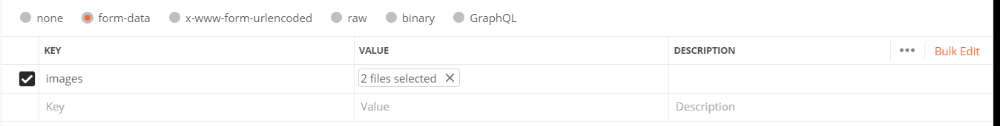
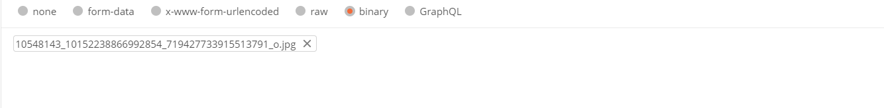
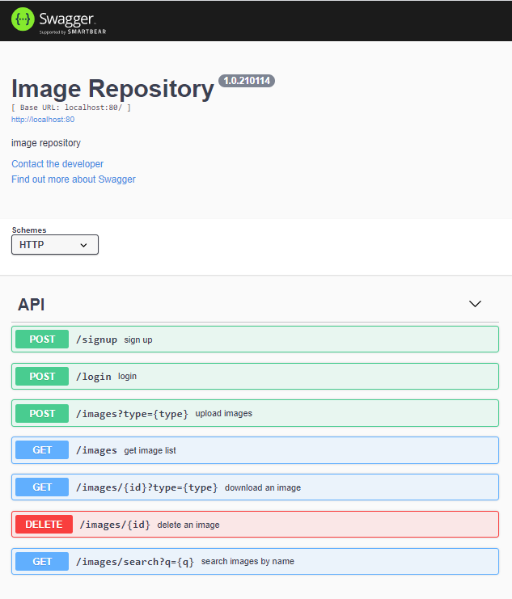

# Node.js Express Image Repo Server

## Project setup
```
mkdir data
npm install
```

### Run
```
node server.js
```

### APIs
The API can be accessed at /api-docs in a running instance of the image repository.
```
POST /signup - create a new user
Parameters:
    Body:
    {
        "email": "email@email.com",
        "password": "mypassword"
    }

Sample Response:
{
  "status": "success",
  "id": "4b0cbeafc6266e1bc3b247492fc42d6e",
  "originalUrl": "/signup"
}
```
```
GET /images - get list of images in repository available to user
Parameters:
    Header: email (string), password (string)

Sample Response:
{
  "status": "success",
  "originalUrl": "/images",
  "result": [
    {
      "id": "38a3abec3a87cd53246bc56a45c3012cqsLDWFE8t+",
      "name": "IMG_20190923_095828.jpg",
      "url": "http://localhost:80/images/38a3abec3a87cd53246bc56a45c3012cqsLDWFE8t+"
    },
    {
      "id": "f5a43c2e9910124d296ebe8519303f86g5CqkjfUH+",
      "name": "IMG_20190813_110211.jpg",
      "url": "http://localhost:80/images/f5a43c2e9910124d296ebe8519303f86g5CqkjfUH+"
    },
    {
      "id": "f5a43c2e9910124d296ebe8519303f86hDdZH0IL8",
      "name": "conceptual.PNG",
      "url": "http://localhost:80/images/f5a43c2e9910124d296ebe8519303f86hDdZH0IL8"
    }
  ]
}
```
```
POST /images?type={type}  - upload images as form-data
Parameters:
    Header: email (string), password (string)
    Form-Data: images (image files)
    Path: type ("public" or "private", optional)

Note that the type defaults to "private", including if the type is not valid.

Sample Response:
{
    "status": "success",
    "originalUrl": "/images?type=public",
    "message": "images uploaded",
    "images": [
        {
            "id": "f5a43c2e9910124d296ebe8519303f86G4p1KtF_0+",
            "name": "tmp9.JPG",
            "url": "http://localhost:80/images/f5a43c2e9910124d296ebe8519303f86G4p1KtF_0+"
        },
        {
            "id": "f5a43c2e9910124d296ebe8519303f86SYyK8_G-I7+",
            "name": "tmp10.JPG",
            "url": "http://localhost:80/images/f5a43c2e9910124d296ebe8519303f86SYyK8_G-I7+"
        }
    ]
}

POST /images/:name  - upload image as binary
For example /images/name1.jpg

Parameters:
    Headers: email (string), password (string)
    Binary Body: image to be uploaded
    Path: type ("public" or "private", optional)

Note that the type defaults to "private", including if the type is not valid.

Sample Response:
{
    "status": "success",
    "message": "image uploaded",
    "originalUrl": "/images/name1.jpg?type=public",
    "id": "f5a43c2e9910124d296ebe8519303f86M6AlbEVsp+",
    "name": "name1.jpg",
    "url": "http://localhost:80/images/f5a43c2e9910124d296ebe8519303f86M6AlbEVsp+"
}

```
```
GET /images/:id?type={type} - download an image you are permitted to access
Parameters:
    Headers (optional for public image): email (string), password (string)
    Path: id (string), type ("original" or "thumbnail", optional)

Note that type defaults to "original" including when type is invalid
```
```
DELETE /images/:id - delete an image you created
Parameters:
    Headers: email (string), password (string)
    Path: id (string)

Sample Response:
{
  "status": "success",
  "originalUrl": "/images/f5a43c2e9910124d296ebe8519303f86RY5TShtO3",
  "name": "1 diagram - Copy.JPG",
  "message": "image deleted"
}
```
```
GET /images/search?q={query} - search images
Parameters:
    Header: email (string), password (string)
    Path: q (string)

Sample Response:
{
  "status": "success",
  "originalUrl": "/images/search?q=conc",
  "result": [
    {
      "id": "f5a43c2e9910124d296ebe8519303f86hDdZH0IL8",
      "name": "conceptual.PNG",
      "url": "http://localhost:80/images/f5a43c2e9910124d296ebe8519303f86hDdZH0IL8"
    }
  ]
}
```
<br><br>

## Configurations
All images are saved in sub-directory /data.<br>

The server listens on port 80 by default, another port can be specified in the environment variable IMGREPO_PORT. <br>

By default the server allows image size up to 10 mega bytes by default, another value can be specified in the environment variable IMGREPO_MAX_IMG_SIZE
<br><br>

## Data folder
The project utilizes a local disk directory /data for saving data which includes the following:<br>
```
Signed user files: user$id.json
Uploaded image files: img$id$orignalfilename
Thumbnail image files: thumbnail$id.filextension
```
It should be straightforward to migrate disk-folder implementation to database if needed.<br><br>

## User Id and image Id
A user id is a hash value over user's email.<br>
An image id is the user's id plus a dynamically auto-generated short unique id.<br>

When user uploads an image, they can add an additional parameter "type=public" to make it public searchable/downloadable. A public image's id ends with character + while a priate image's id does not.<br><br>

##  Upload images from Postman
### form-data type body
In Postman, create a new post request to the route /images; click on the "form-data", then add "images" as a key and you will see a hidden drop-down at the right of the key field which says Text as default,  change the type from text to file and choose one or multiple image files to upload.<br>
<br><br><br>
### binary type body
Binary is designed to send the information in a format that cannot be entered manually, to use this option, create a new post request to the route /images/:name (here name is the image file name);  click on the "binary", a "CHOOSE FILES" option will be available, click it to select an image file to upload.<br>
Please note image name must be specified in the route<br>
<br><br><br>

## Test APIs by Swagger
Alternatively you may use the builtin swagger endpoint "/api-docs" to test it
<br><br><br>


## References
[1] [How to upload files in Node.js and Express](https://attacomsian.com/blog/uploading-files-nodejs-express)<br>
[2] [Express File Upload with Multer in Node.js](https://attacomsian.com/blog/express-file-upload-multer)<br>
[3] [Generate an image thumbnail](https://github.com/onildoaguiar/image-thumbnail)<br>
[4] [React file upload: proper and easy way, with NodeJS!](https://programmingwithmosh.com/javascript/react-file-upload-proper-server-side-nodejs-easy/) <br>
[5] [How to upload files in React with NodeJS & Express](https://reactgo.com/react-file-upload/)<br>
[6] [How to deploy a node.js application on aws ec2 server](https://ourcodeworld.com/articles/read/977/how-to-deploy-a-node-js-application-on-aws-ec2-server)<br>
[7] [AWS npm install failed](https://stackoverflow.com/questions/54096891/npm-install-fails-on-ubuntu-18-04-with-error-failed-at-the-bcrypt3-0-3-insta)